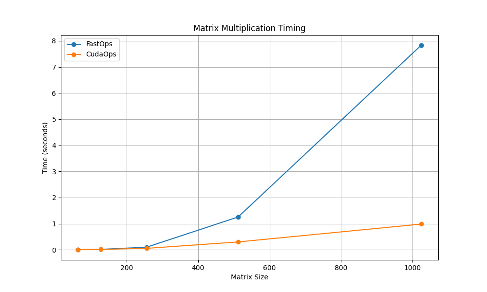

# MiniTorch Module 3


* Docs: https://minitorch.github.io/

* Overview: https://minitorch.github.io/module3.html


You will need to modify `tensor_functions.py` slightly in this assignment.

* Tests:

```
python run_tests.py
```

* Note:

Several of the tests for this assignment will only run if you are on a GPU machine and will not
run on github's test infrastructure. Please follow the instructions to setup up a colab machine
to run these tests.

This assignment requires the following files from the previous assignments. You can get these by running

```bash
python sync_previous_module.py previous-module-dir current-module-dir
```

The files that will be synced are:

        minitorch/tensor_data.py minitorch/tensor_functions.py minitorch/tensor_ops.py minitorch/operators.py minitorch/scalar.py minitorch/scalar_functions.py minitorch/module.py minitorch/autodiff.py minitorch/module.py project/run_manual.py project/run_scalar.py project/run_tensor.py minitorch/operators.py minitorch/module.py minitorch/autodiff.py minitorch/tensor.py minitorch/datasets.py minitorch/testing.py minitorch/optim.py

# Parallelization Output

```console
MAP

================================================================================
 Parallel Accelerator Optimizing:  Function tensor_map.<locals>._map,
/Users/vanshikabajaj/workspace/mod3-vanshika364/minitorch/fast_ops.py (199)
================================================================================


Parallel loop listing for  Function tensor_map.<locals>._map, /Users/vanshikabajaj/workspace/mod3-vanshika364/minitorch/fast_ops.py (199)
------------------------------------------------------------------------------------|loop #ID
    def _map(                                                                       |
        out: Storage,                                                               |
        out_shape: Shape,                                                           |
        out_strides: Strides,                                                       |
        in_storage: Storage,                                                        |
        in_shape: Shape,                                                            |
        in_strides: Strides,                                                        |
    ) -> None:                                                                      |
        # TODO: Implement for Task 3.1.                                             |
        # raise NotImplementedError("Need to implement for Task 3.1")               |
        stride_aligned = np.array_equal(out_shape, in_shape) and np.array_equal(    |
            out_strides, in_strides                                                 |
        )                                                                           |
                                                                                    |
        if stride_aligned:                                                          |
            for i in prange(len(out)):----------------------------------------------| #2
                out[i] = fn(in_storage[i])                                          |
        else:                                                                       |
            for i in prange(len(out)):----------------------------------------------| #3
                in_index = np.zeros(len(in_shape), dtype=np.int32)------------------| #0
                out_index = np.zeros(len(out_shape), dtype=np.int32)----------------| #1
                to_index(i, out_shape, out_index)                                   |
                broadcast_index(out_index, out_shape, in_shape, in_index)           |
                in_pos = index_to_position(in_index, in_strides)                    |
                out_pos = index_to_position(out_index, out_strides)                 |
                out[out_pos] = fn(in_storage[in_pos])                               |
--------------------------------- Fusing loops ---------------------------------
Attempting fusion of parallel loops (combines loops with similar properties)...
Following the attempted fusion of parallel for-loops there are 4 parallel for-
loop(s) (originating from loops labelled: #2, #3, #0, #1).
--------------------------------------------------------------------------------
---------------------------- Optimising loop nests -----------------------------
Attempting loop nest rewrites (optimising for the largest parallel loops)...

+--3 is a parallel loop
   +--0 --> rewritten as a serial loop
   +--1 --> rewritten as a serial loop
--------------------------------------------------------------------------------
----------------------------- Before Optimisation ------------------------------
Parallel region 0:
+--3 (parallel)
   +--0 (parallel)
   +--1 (parallel)


--------------------------------------------------------------------------------
------------------------------ After Optimisation ------------------------------
Parallel region 0:
+--3 (parallel)
   +--0 (serial)
   +--1 (serial)


Parallel region 0 (loop #3) had 0 loop(s) fused and 2 loop(s) serialized as part
 of the larger parallel loop (#3).
--------------------------------------------------------------------------------
--------------------------------------------------------------------------------

---------------------------Loop invariant code motion---------------------------
Allocation hoisting:
The memory allocation derived from the instruction at
/Users/vanshikabajaj/workspace/mod3-vanshika364/minitorch/fast_ops.py (218) is
hoisted out of the parallel loop labelled #3 (it will be performed before the
loop is executed and reused inside the loop):
   Allocation:: in_index = np.zeros(len(in_shape), dtype=np.int32)
    - numpy.empty() is used for the allocation.
The memory allocation derived from the instruction at
/Users/vanshikabajaj/workspace/mod3-vanshika364/minitorch/fast_ops.py (219) is
hoisted out of the parallel loop labelled #3 (it will be performed before the
loop is executed and reused inside the loop):
   Allocation:: out_index = np.zeros(len(out_shape), dtype=np.int32)
    - numpy.empty() is used for the allocation.
None
ZIP

================================================================================
 Parallel Accelerator Optimizing:  Function tensor_zip.<locals>._zip,
/Users/vanshikabajaj/workspace/mod3-vanshika364/minitorch/fast_ops.py (252)
================================================================================


Parallel loop listing for  Function tensor_zip.<locals>._zip, /Users/vanshikabajaj/workspace/mod3-vanshika364/minitorch/fast_ops.py (252)
---------------------------------------------------------------------------|loop #ID
    def _zip(                                                              |
        out: Storage,                                                      |
        out_shape: Shape,                                                  |
        out_strides: Strides,                                              |
        a_storage: Storage,                                                |
        a_shape: Shape,                                                    |
        a_strides: Strides,                                                |
        b_storage: Storage,                                                |
        b_shape: Shape,                                                    |
        b_strides: Strides,                                                |
    ) -> None:                                                             |
        # TODO: Implement for Task 3.1.                                    |
        # raise NotImplementedError("Need to implement for Task 3.1")      |
        stride_aligned = (                                                 |
            np.array_equal(out_shape, a_shape)                             |
            and np.array_equal(out_shape, b_shape)                         |
            and np.array_equal(out_strides, a_strides)                     |
            and np.array_equal(out_strides, b_strides)                     |
        )                                                                  |
                                                                           |
        if stride_aligned:                                                 |
            for i in prange(len(out)):-------------------------------------| #7
                out[i] = fn(a_storage[i], b_storage[i])                    |
        else:                                                              |
            for i in prange(len(out)):-------------------------------------| #8
                out_index = np.zeros(len(out_shape), dtype=np.int32)-------| #4
                to_index(i, out_shape, out_index)                          |
                a_index = np.zeros(len(a_shape), dtype=np.int32)-----------| #5
                b_index = np.zeros(len(b_shape), dtype=np.int32)-----------| #6
                broadcast_index(out_index, out_shape, a_shape, a_index)    |
                broadcast_index(out_index, out_shape, b_shape, b_index)    |
                                                                           |
                out_pos = index_to_position(out_index, out_strides)        |
                a_pos = index_to_position(a_index, a_strides)              |
                b_pos = index_to_position(b_index, b_strides)              |
                out[out_pos] = fn(a_storage[a_pos], b_storage[b_pos])      |
--------------------------------- Fusing loops ---------------------------------
Attempting fusion of parallel loops (combines loops with similar properties)...
Following the attempted fusion of parallel for-loops there are 3 parallel for-
loop(s) (originating from loops labelled: #7, #8, #4).
--------------------------------------------------------------------------------
---------------------------- Optimising loop nests -----------------------------
Attempting loop nest rewrites (optimising for the largest parallel loops)...

+--8 is a parallel loop
   +--4 --> rewritten as a serial loop
   +--5 --> rewritten as a serial loop
   +--6 --> rewritten as a serial loop
--------------------------------------------------------------------------------
----------------------------- Before Optimisation ------------------------------
Parallel region 0:
+--8 (parallel)
   +--4 (parallel)
   +--5 (parallel)
   +--6 (parallel)


--------------------------------------------------------------------------------
------------------------------ After Optimisation ------------------------------
Parallel region 0:
+--8 (parallel)
   +--4 (serial)
   +--5 (serial)
   +--6 (serial)


Parallel region 0 (loop #8) had 0 loop(s) fused and 3 loop(s) serialized as part
 of the larger parallel loop (#8).
--------------------------------------------------------------------------------
--------------------------------------------------------------------------------

---------------------------Loop invariant code motion---------------------------
Allocation hoisting:
The memory allocation derived from the instruction at
/Users/vanshikabajaj/workspace/mod3-vanshika364/minitorch/fast_ops.py (277) is
hoisted out of the parallel loop labelled #8 (it will be performed before the
loop is executed and reused inside the loop):
   Allocation:: out_index = np.zeros(len(out_shape), dtype=np.int32)
    - numpy.empty() is used for the allocation.
The memory allocation derived from the instruction at
/Users/vanshikabajaj/workspace/mod3-vanshika364/minitorch/fast_ops.py (279) is
hoisted out of the parallel loop labelled #8 (it will be performed before the
loop is executed and reused inside the loop):
   Allocation:: a_index = np.zeros(len(a_shape), dtype=np.int32)
    - numpy.empty() is used for the allocation.
The memory allocation derived from the instruction at
/Users/vanshikabajaj/workspace/mod3-vanshika364/minitorch/fast_ops.py (280) is
hoisted out of the parallel loop labelled #8 (it will be performed before the
loop is executed and reused inside the loop):
   Allocation:: b_index = np.zeros(len(b_shape), dtype=np.int32)
    - numpy.empty() is used for the allocation.
None
REDUCE

================================================================================
 Parallel Accelerator Optimizing:  Function tensor_reduce.<locals>._reduce,
/Users/vanshikabajaj/workspace/mod3-vanshika364/minitorch/fast_ops.py (313)
================================================================================


Parallel loop listing for  Function tensor_reduce.<locals>._reduce, /Users/vanshikabajaj/workspace/mod3-vanshika364/minitorch/fast_ops.py (313)
-------------------------------------------------------------------------|loop #ID
    def _reduce(                                                         |
        out: Storage,                                                    |
        out_shape: Shape,                                                |
        out_strides: Strides,                                            |
        a_storage: Storage,                                              |
        a_shape: Shape,                                                  |
        a_strides: Strides,                                              |
        reduce_dim: int,                                                 |
    ) -> None:                                                           |
        # TODO: Implement for Task 3.1.                                  |
        # raise NotImplementedError("Need to implement for Task 3.1")    |
                                                                         |
        r_size = a_shape[reduce_dim]                                     |
        for i in prange(len(out)):---------------------------------------| #10
            out_index = np.zeros(len(out_shape), dtype=np.int32)---------| #9
            to_index(i, out_shape, out_index)                            |
            pos = index_to_position(out_index, out_strides)              |
            accum = out[pos]  # Use accumulator variable                 |
            for v in range(r_size):                                      |
                out_index[reduce_dim] = v                                |
                j = index_to_position(out_index, a_strides)              |
                accum = fn(accum, a_storage[j])                          |
            out[pos] = accum                                             |
--------------------------------- Fusing loops ---------------------------------
Attempting fusion of parallel loops (combines loops with similar properties)...
Following the attempted fusion of parallel for-loops there are 2 parallel for-
loop(s) (originating from loops labelled: #10, #9).
--------------------------------------------------------------------------------
---------------------------- Optimising loop nests -----------------------------
Attempting loop nest rewrites (optimising for the largest parallel loops)...

+--10 is a parallel loop
   +--9 --> rewritten as a serial loop
--------------------------------------------------------------------------------
----------------------------- Before Optimisation ------------------------------
Parallel region 0:
+--10 (parallel)
   +--9 (parallel)


--------------------------------------------------------------------------------
------------------------------ After Optimisation ------------------------------
Parallel region 0:
+--10 (parallel)
   +--9 (serial)


Parallel region 0 (loop #10) had 0 loop(s) fused and 1 loop(s) serialized as
part of the larger parallel loop (#10).
--------------------------------------------------------------------------------
--------------------------------------------------------------------------------

---------------------------Loop invariant code motion---------------------------
Allocation hoisting:
The memory allocation derived from the instruction at
/Users/vanshikabajaj/workspace/mod3-vanshika364/minitorch/fast_ops.py (327) is
hoisted out of the parallel loop labelled #10 (it will be performed before the
loop is executed and reused inside the loop):
   Allocation:: out_index = np.zeros(len(out_shape), dtype=np.int32)
    - numpy.empty() is used for the allocation.
None
MATRIX MULTIPLY

================================================================================
 Parallel Accelerator Optimizing:  Function _tensor_matrix_multiply,
/Users/vanshikabajaj/workspace/mod3-vanshika364/minitorch/fast_ops.py (340)
================================================================================


Parallel loop listing for  Function _tensor_matrix_multiply, /Users/vanshikabajaj/workspace/mod3-vanshika364/minitorch/fast_ops.py (340)
------------------------------------------------------------------------------------------|loop #ID
def _tensor_matrix_multiply(                                                              |
    out: Storage,                                                                         |
    out_shape: Shape,                                                                     |
    out_strides: Strides,                                                                 |
    a_storage: Storage,                                                                   |
    a_shape: Shape,                                                                       |
    a_strides: Strides,                                                                   |
    b_storage: Storage,                                                                   |
    b_shape: Shape,                                                                       |
    b_strides: Strides,                                                                   |
) -> None:                                                                                |
    """NUMBA tensor matrix multiply function.                                             |
                                                                                          |
    Should work for any tensor shapes that broadcast as long as                           |
                                                                                          |
    ```                                                                                   |
    assert a_shape[-1] == b_shape[-2]                                                     |
    ```                                                                                   |
                                                                                          |
    Optimizations:                                                                        |
                                                                                          |
    * Outer loop in parallel                                                              |
    * No index buffers or function calls                                                  |
    * Inner loop should have no global writes, 1 multiply.                                |
                                                                                          |
                                                                                          |
    Args:                                                                                 |
    ----                                                                                  |
        out (Storage): storage for `out` tensor                                           |
        out_shape (Shape): shape for `out` tensor                                         |
        out_strides (Strides): strides for `out` tensor                                   |
        a_storage (Storage): storage for `a` tensor                                       |
        a_shape (Shape): shape for `a` tensor                                             |
        a_strides (Strides): strides for `a` tensor                                       |
        b_storage (Storage): storage for `b` tensor                                       |
        b_shape (Shape): shape for `b` tensor                                             |
        b_strides (Strides): strides for `b` tensor                                       |
                                                                                          |
    Returns:                                                                              |
    -------                                                                               |
        None : Fills in `out`                                                             |
                                                                                          |
    """                                                                                   |
    # a_batch_stride = a_strides[0] if a_shape[0] > 1 else 0                              |
    # b_batch_stride = b_strides[0] if b_shape[0] > 1 else 0                              |
                                                                                          |
    # TODO: Implement for Task 3.2.                                                       |
    # raise NotImplementedError("Need to implement for Task 3.2")                         |
    batch_size, out_rows, out_cols = out_shape                                            |
    a_rows, a_cols = a_shape[-2], a_shape[-1]                                             |
    b_rows, b_cols = b_shape[-2], b_shape[-1]                                             |
    assert a_cols == b_rows, "Matrix multiplication dimension mismatch."                  |
    for batch in prange(batch_size):------------------------------------------------------| #11
        a_batch_start = batch * a_strides[0] if a_shape[0] > 1 else 0                     |
        b_batch_start = batch * b_strides[0] if b_shape[0] > 1 else 0                     |
        for i in range(out_rows):                                                         |
            a_row_start = a_batch_start + i * a_strides[-2]                               |
            for j in range(out_cols):                                                     |
                b_col_start = b_batch_start + j * b_strides[-1]                           |
                result = 0.0                                                              |
                for k in range(a_cols):                                                   |
                    a_index = a_row_start + k * a_strides[-1]                             |
                    b_index = b_col_start + k * b_strides[-2]                             |
                    result += a_storage[a_index] * b_storage[b_index]                     |
                out_index = (                                                             |
                    batch * out_strides[0] + i * out_strides[-2] + j * out_strides[-1]    |
                )                                                                         |
                out[out_index] = result                                                   |
--------------------------------- Fusing loops ---------------------------------
Attempting fusion of parallel loops (combines loops with similar properties)...
Following the attempted fusion of parallel for-loops there are 1 parallel for-
loop(s) (originating from loops labelled: #11).
--------------------------------------------------------------------------------
----------------------------- Before Optimisation ------------------------------
--------------------------------------------------------------------------------
------------------------------ After Optimisation ------------------------------
Parallel structure is already optimal.
--------------------------------------------------------------------------------
--------------------------------------------------------------------------------

---------------------------Loop invariant code motion---------------------------
Allocation hoisting:
No allocation hoisting found
None
```
# Training logs
# 1. Simple Dataset

# CPU Output:


# GPU Output:
```console
Epoch 0 | Loss: 5.5860 | Correct: 46 | Time: 4.06 sec
Epoch 10 | Loss: 3.5058 | Correct: 42 | Time: 2.49 sec
Epoch 20 | Loss: 1.2429 | Correct: 46 | Time: 1.89 sec
Epoch 30 | Loss: 0.3169 | Correct: 45 | Time: 1.87 sec
Epoch 40 | Loss: 1.1785 | Correct: 50 | Time: 2.26 sec
Epoch 50 | Loss: 1.3917 | Correct: 50 | Time: 1.89 sec
Epoch 60 | Loss: 0.5542 | Correct: 50 | Time: 1.86 sec
Epoch 70 | Loss: 1.2911 | Correct: 47 | Time: 1.95 sec
Epoch 80 | Loss: 0.3420 | Correct: 50 | Time: 1.90 sec
Epoch 90 | Loss: 0.4726 | Correct: 50 | Time: 1.88 sec
Epoch 100 | Loss: 0.8205 | Correct: 50 | Time: 1.86 sec
Epoch 110 | Loss: 0.6698 | Correct: 50 | Time: 2.68 sec
Epoch 120 | Loss: 0.1024 | Correct: 50 | Time: 1.91 sec
Epoch 130 | Loss: 0.9405 | Correct: 50 | Time: 1.87 sec
Epoch 140 | Loss: 0.9249 | Correct: 50 | Time: 2.37 sec
Epoch 150 | Loss: 0.9851 | Correct: 50 | Time: 1.89 sec
Epoch 160 | Loss: 0.2260 | Correct: 50 | Time: 1.93 sec
Epoch 170 | Loss: 0.3606 | Correct: 50 | Time: 2.52 sec
Epoch 180 | Loss: 0.5600 | Correct: 50 | Time: 1.86 sec
Epoch 190 | Loss: 0.8429 | Correct: 50 | Time: 1.87 sec
Epoch 200 | Loss: 0.9978 | Correct: 50 | Time: 2.72 sec
Epoch 210 | Loss: 1.1609 | Correct: 49 | Time: 1.86 sec
Epoch 220 | Loss: 0.2671 | Correct: 50 | Time: 1.90 sec
Epoch 230 | Loss: 0.5918 | Correct: 50 | Time: 2.89 sec
Epoch 240 | Loss: 0.4944 | Correct: 50 | Time: 1.94 sec
Epoch 250 | Loss: 0.3836 | Correct: 50 | Time: 1.91 sec
Epoch 260 | Loss: 0.1303 | Correct: 50 | Time: 2.49 sec
Epoch 270 | Loss: 0.1470 | Correct: 50 | Time: 1.87 sec
Epoch 280 | Loss: 0.2369 | Correct: 50 | Time: 1.94 sec
Epoch 290 | Loss: 0.4412 | Correct: 50 | Time: 2.40 sec
Epoch 300 | Loss: 0.4826 | Correct: 50 | Time: 1.87 sec
Epoch 310 | Loss: 0.1910 | Correct: 50 | Time: 1.89 sec
Epoch 320 | Loss: 0.2704 | Correct: 50 | Time: 2.21 sec
Epoch 330 | Loss: 0.0755 | Correct: 50 | Time: 1.92 sec
Epoch 340 | Loss: 0.0916 | Correct: 50 | Time: 1.89 sec
Epoch 350 | Loss: 0.3227 | Correct: 50 | Time: 2.05 sec
Epoch 360 | Loss: 0.2596 | Correct: 50 | Time: 1.88 sec
Epoch 370 | Loss: 0.1371 | Correct: 50 | Time: 1.93 sec
Epoch 380 | Loss: 0.2715 | Correct: 50 | Time: 1.96 sec
Epoch 390 | Loss: 0.0156 | Correct: 50 | Time: 1.88 sec
Epoch 400 | Loss: 0.2836 | Correct: 50 | Time: 1.87 sec
Epoch 410 | Loss: 0.1015 | Correct: 50 | Time: 1.95 sec
Epoch 420 | Loss: 0.3180 | Correct: 50 | Time: 2.06 sec
Epoch 430 | Loss: 0.2550 | Correct: 50 | Time: 1.87 sec
Epoch 440 | Loss: 0.2589 | Correct: 50 | Time: 1.88 sec
Epoch 450 | Loss: 0.0061 | Correct: 50 | Time: 2.22 sec
Epoch 460 | Loss: 0.0392 | Correct: 50 | Time: 1.92 sec
Epoch 470 | Loss: -0.0000 | Correct: 50 | Time: 1.88 sec
Epoch 480 | Loss: 0.1088 | Correct: 50 | Time: 2.52 sec
Epoch 490 | Loss: 0.0685 | Correct: 50 | Time: 1.86 sec
Average epoch time: 1.2093s
```

# 2. Split Dataset

# CPU Output:


# GPU Output:
``` console
Epoch 0 | Loss: 8.0220 | Correct: 30 | Time: 4.02 sec
Epoch 10 | Loss: 6.0884 | Correct: 38 | Time: 1.86 sec
Epoch 20 | Loss: 4.7930 | Correct: 44 | Time: 2.71 sec
Epoch 30 | Loss: 4.2489 | Correct: 44 | Time: 1.86 sec
Epoch 40 | Loss: 2.8546 | Correct: 45 | Time: 1.92 sec
Epoch 50 | Loss: 2.2118 | Correct: 46 | Time: 2.33 sec
Epoch 60 | Loss: 2.1866 | Correct: 48 | Time: 1.86 sec
Epoch 70 | Loss: 2.0989 | Correct: 47 | Time: 1.85 sec
Epoch 80 | Loss: 1.7148 | Correct: 48 | Time: 2.21 sec
Epoch 90 | Loss: 1.7068 | Correct: 47 | Time: 1.87 sec
Epoch 100 | Loss: 1.6560 | Correct: 50 | Time: 1.87 sec
Epoch 110 | Loss: 1.8391 | Correct: 50 | Time: 1.86 sec
Epoch 120 | Loss: 2.1931 | Correct: 49 | Time: 1.96 sec
Epoch 130 | Loss: 1.2652 | Correct: 49 | Time: 1.89 sec
Epoch 140 | Loss: 1.1093 | Correct: 50 | Time: 1.87 sec
Epoch 150 | Loss: 1.3989 | Correct: 50 | Time: 1.87 sec
Epoch 160 | Loss: 0.8475 | Correct: 50 | Time: 1.93 sec
Epoch 170 | Loss: 0.6952 | Correct: 50 | Time: 1.87 sec
Epoch 180 | Loss: 0.3561 | Correct: 50 | Time: 2.10 sec
Epoch 190 | Loss: 0.8465 | Correct: 50 | Time: 1.87 sec
Epoch 200 | Loss: 0.7683 | Correct: 50 | Time: 1.93 sec
Epoch 210 | Loss: 0.8127 | Correct: 50 | Time: 2.11 sec
Epoch 220 | Loss: 0.2782 | Correct: 50 | Time: 1.86 sec
Epoch 230 | Loss: 0.5741 | Correct: 50 | Time: 1.88 sec
Epoch 240 | Loss: 0.5726 | Correct: 50 | Time: 2.47 sec
Epoch 250 | Loss: 0.1023 | Correct: 50 | Time: 1.87 sec
Epoch 260 | Loss: 0.3876 | Correct: 50 | Time: 1.86 sec
Epoch 270 | Loss: 0.7687 | Correct: 50 | Time: 2.59 sec
Epoch 280 | Loss: 0.4280 | Correct: 50 | Time: 1.92 sec
Epoch 290 | Loss: 0.1552 | Correct: 50 | Time: 1.90 sec
Epoch 300 | Loss: 0.2462 | Correct: 50 | Time: 1.99 sec
Epoch 310 | Loss: 0.1752 | Correct: 50 | Time: 1.86 sec
Epoch 320 | Loss: 0.2140 | Correct: 50 | Time: 1.86 sec
Epoch 330 | Loss: 0.1159 | Correct: 50 | Time: 1.91 sec
Epoch 340 | Loss: 0.1478 | Correct: 50 | Time: 1.90 sec
Epoch 350 | Loss: 1.0955 | Correct: 50 | Time: 1.86 sec
Epoch 360 | Loss: 0.5243 | Correct: 50 | Time: 1.89 sec
Epoch 370 | Loss: 0.4266 | Correct: 50 | Time: 2.29 sec
Epoch 380 | Loss: 0.4118 | Correct: 50 | Time: 1.86 sec
Epoch 390 | Loss: 0.2003 | Correct: 50 | Time: 1.87 sec
Epoch 400 | Loss: 0.2119 | Correct: 50 | Time: 2.35 sec
Epoch 410 | Loss: 0.2899 | Correct: 50 | Time: 1.92 sec
Epoch 420 | Loss: 0.1739 | Correct: 50 | Time: 1.86 sec
Epoch 430 | Loss: 0.2190 | Correct: 50 | Time: 2.58 sec
Epoch 440 | Loss: 0.0710 | Correct: 50 | Time: 1.86 sec
Epoch 450 | Loss: 0.3014 | Correct: 50 | Time: 1.88 sec
Epoch 460 | Loss: 0.4941 | Correct: 50 | Time: 2.49 sec
Epoch 470 | Loss: 0.2925 | Correct: 50 | Time: 1.89 sec
Epoch 480 | Loss: 0.0948 | Correct: 50 | Time: 1.89 sec
Epoch 490 | Loss: 0.4950 | Correct: 50 | Time: 2.04 sec
Average epoch time: 1.2009s
```

# 3. XOR Dataset

# CPU Output:


# GPU Output:
``` console
Epoch 0 | Loss: 8.9889 | Correct: 32 | Time: 4.13 sec
Epoch 10 | Loss: 5.0796 | Correct: 38 | Time: 1.88 sec
Epoch 20 | Loss: 3.8579 | Correct: 43 | Time: 2.64 sec
Epoch 30 | Loss: 3.2632 | Correct: 45 | Time: 1.92 sec
Epoch 40 | Loss: 4.1044 | Correct: 47 | Time: 1.93 sec
Epoch 50 | Loss: 2.9894 | Correct: 46 | Time: 1.91 sec
Epoch 60 | Loss: 2.7594 | Correct: 45 | Time: 1.86 sec
Epoch 70 | Loss: 3.3671 | Correct: 45 | Time: 1.95 sec
Epoch 80 | Loss: 4.0239 | Correct: 48 | Time: 1.88 sec
Epoch 90 | Loss: 2.1828 | Correct: 47 | Time: 1.99 sec
Epoch 100 | Loss: 1.0668 | Correct: 47 | Time: 1.91 sec
Epoch 110 | Loss: 1.5246 | Correct: 47 | Time: 1.94 sec
Epoch 120 | Loss: 1.9071 | Correct: 47 | Time: 2.13 sec
Epoch 130 | Loss: 1.1494 | Correct: 49 | Time: 1.88 sec
Epoch 140 | Loss: 3.2460 | Correct: 49 | Time: 1.87 sec
Epoch 150 | Loss: 1.3694 | Correct: 49 | Time: 3.05 sec
Epoch 160 | Loss: 0.7996 | Correct: 47 | Time: 1.94 sec
Epoch 170 | Loss: 1.4419 | Correct: 49 | Time: 1.89 sec
Epoch 180 | Loss: 1.2835 | Correct: 49 | Time: 2.68 sec
Epoch 190 | Loss: 1.8290 | Correct: 50 | Time: 1.86 sec
Epoch 200 | Loss: 0.6709 | Correct: 49 | Time: 1.97 sec
Epoch 210 | Loss: 1.9611 | Correct: 50 | Time: 2.45 sec
Epoch 220 | Loss: 2.0975 | Correct: 49 | Time: 1.88 sec
Epoch 230 | Loss: 2.3496 | Correct: 50 | Time: 1.88 sec
Epoch 240 | Loss: 0.6781 | Correct: 49 | Time: 2.40 sec
Epoch 250 | Loss: 0.2503 | Correct: 50 | Time: 1.88 sec
Epoch 260 | Loss: 1.1060 | Correct: 49 | Time: 1.89 sec
Epoch 270 | Loss: 0.4009 | Correct: 49 | Time: 2.57 sec
Epoch 280 | Loss: 1.4594 | Correct: 49 | Time: 1.95 sec
Epoch 290 | Loss: 0.4334 | Correct: 49 | Time: 1.95 sec
Epoch 300 | Loss: 1.4522 | Correct: 50 | Time: 1.86 sec
Epoch 310 | Loss: 0.7516 | Correct: 50 | Time: 1.96 sec
Epoch 320 | Loss: 0.2273 | Correct: 50 | Time: 1.87 sec
Epoch 330 | Loss: 0.9439 | Correct: 49 | Time: 1.93 sec
Epoch 340 | Loss: 0.3311 | Correct: 49 | Time: 2.05 sec
Epoch 350 | Loss: 0.3577 | Correct: 50 | Time: 1.88 sec
Epoch 360 | Loss: 1.0849 | Correct: 50 | Time: 1.87 sec
Epoch 370 | Loss: 0.1125 | Correct: 50 | Time: 2.27 sec
Epoch 380 | Loss: 1.0324 | Correct: 49 | Time: 1.86 sec
Epoch 390 | Loss: 0.2150 | Correct: 50 | Time: 1.88 sec
Epoch 400 | Loss: 0.0954 | Correct: 50 | Time: 2.09 sec
Epoch 410 | Loss: 0.2605 | Correct: 49 | Time: 1.93 sec
Epoch 420 | Loss: 0.6928 | Correct: 49 | Time: 1.86 sec
Epoch 430 | Loss: 1.1219 | Correct: 49 | Time: 2.08 sec
Epoch 440 | Loss: 0.0319 | Correct: 50 | Time: 1.88 sec
Epoch 450 | Loss: 0.0777 | Correct: 50 | Time: 1.85 sec
Epoch 460 | Loss: 1.1778 | Correct: 50 | Time: 2.20 sec
Epoch 470 | Loss: 0.3861 | Correct: 50 | Time: 1.87 sec
Epoch 480 | Loss: 0.0942 | Correct: 50 | Time: 1.85 sec
Epoch 490 | Loss: 1.4236 | Correct: 50 | Time: 2.24 sec
Average epoch time: 1.2126s
```


# Large Model - Simple Dataset with 500 Hidden Layers
# CPU
```console
Epoch 0 | Loss: 5.4545 | Correct: 27 | Time: 4.73 sec
Epoch 10 | Loss: 3.1678 | Correct: 41 | Time: 3.03 sec
Epoch 20 | Loss: 2.3953 | Correct: 44 | Time: 1.98 sec
Epoch 30 | Loss: 2.1118 | Correct: 50 | Time: 2.00 sec
Epoch 40 | Loss: 0.8339 | Correct: 45 | Time: 1.98 sec
Epoch 50 | Loss: 1.0141 | Correct: 45 | Time: 2.09 sec
Epoch 60 | Loss: 0.8052 | Correct: 43 | Time: 2.92 sec
Epoch 70 | Loss: 0.4255 | Correct: 46 | Time: 1.99 sec
Epoch 80 | Loss: 0.7977 | Correct: 41 | Time: 2.09 sec
Epoch 90 | Loss: 1.1026 | Correct: 43 | Time: 2.01 sec
Epoch 100 | Loss: 1.0845 | Correct: 41 | Time: 1.98 sec
Epoch 110 | Loss: 0.4010 | Correct: 40 | Time: 2.56 sec
Epoch 120 | Loss: 1.4868 | Correct: 42 | Time: 2.21 sec
Epoch 130 | Loss: 2.5886 | Correct: 40 | Time: 2.01 sec
Epoch 140 | Loss: 0.1533 | Correct: 41 | Time: 1.98 sec
Epoch 150 | Loss: 0.8975 | Correct: 44 | Time: 1.98 sec
Epoch 160 | Loss: 1.0108 | Correct: 43 | Time: 2.80 sec
Epoch 170 | Loss: 0.5922 | Correct: 44 | Time: 2.03 sec
Epoch 180 | Loss: 1.1147 | Correct: 44 | Time: 1.98 sec
Epoch 190 | Loss: 0.2896 | Correct: 41 | Time: 2.04 sec
Epoch 200 | Loss: 0.3839 | Correct: 43 | Time: 1.99 sec
Epoch 210 | Loss: 1.5147 | Correct: 43 | Time: 3.32 sec
Epoch 220 | Loss: 0.5105 | Correct: 42 | Time: 2.31 sec
Epoch 230 | Loss: 0.7584 | Correct: 41 | Time: 2.03 sec
Epoch 240 | Loss: 3.9592 | Correct: 42 | Time: 2.01 sec
Epoch 250 | Loss: 1.4919 | Correct: 40 | Time: 2.00 sec
Epoch 260 | Loss: 0.0981 | Correct: 42 | Time: 2.59 sec
Epoch 270 | Loss: 1.0530 | Correct: 42 | Time: 2.22 sec
Epoch 280 | Loss: 1.4853 | Correct: 42 | Time: 1.98 sec
Epoch 290 | Loss: 2.1601 | Correct: 44 | Time: 1.97 sec
Epoch 300 | Loss: 0.8752 | Correct: 42 | Time: 2.04 sec
Epoch 310 | Loss: 1.0606 | Correct: 41 | Time: 2.76 sec
Epoch 320 | Loss: 0.9169 | Correct: 40 | Time: 2.70 sec
Epoch 330 | Loss: 2.4404 | Correct: 43 | Time: 2.01 sec
Epoch 340 | Loss: 1.1132 | Correct: 36 | Time: 2.04 sec
Epoch 350 | Loss: 0.9201 | Correct: 41 | Time: 1.99 sec
Epoch 360 | Loss: 0.8513 | Correct: 41 | Time: 2.85 sec
Epoch 370 | Loss: 0.5808 | Correct: 41 | Time: 1.99 sec
Epoch 380 | Loss: 1.1627 | Correct: 42 | Time: 2.12 sec
Epoch 390 | Loss: 0.2160 | Correct: 41 | Time: 1.99 sec
Epoch 400 | Loss: 2.1411 | Correct: 43 | Time: 2.01 sec
Epoch 410 | Loss: 1.5393 | Correct: 40 | Time: 2.68 sec
Epoch 420 | Loss: 0.5960 | Correct: 36 | Time: 2.19 sec
Epoch 430 | Loss: 0.9541 | Correct: 36 | Time: 2.04 sec
Epoch 440 | Loss: 2.7335 | Correct: 34 | Time: 2.03 sec
Epoch 450 | Loss: 2.2777 | Correct: 37 | Time: 2.09 sec
Epoch 460 | Loss: 2.9155 | Correct: 41 | Time: 2.09 sec
Epoch 470 | Loss: 2.3326 | Correct: 38 | Time: 2.73 sec
Epoch 480 | Loss: 2.4229 | Correct: 38 | Time: 2.02 sec
Epoch 490 | Loss: 1.0668 | Correct: 36 | Time: 2.11 sec
Average epoch time: 1.2798s
```

# Matrix Multiplication Timing:
``` console
Running size 64
{'fast': 0.003897524019671672, 'gpu': 0.007510829837612286}
Running size 128
{'fast': 0.016298493276121072, 'gpu': 0.015607430140092373}
Running size 256
{'fast': 0.09875633076305245, 'gpu': 0.05402985341720439}
Running size 512
{'fast': 1.267541083450636, 'gpu': 0.3118925332827127}
Running size 1024
{'fast': 8.023195620455732, 'gpu': 1.0149920278623104}

Timing summary
Size: 64
    fast: 0.00390
    gpu: 0.00751
Size: 128
    fast: 0.01630
    gpu: 0.01561
Size: 256
    fast: 0.09876
    gpu: 0.05403
Size: 512
    fast: 1.26754
    gpu: 0.31189
Size: 1024
    fast: 8.02320
    gpu: 1.01499
```
